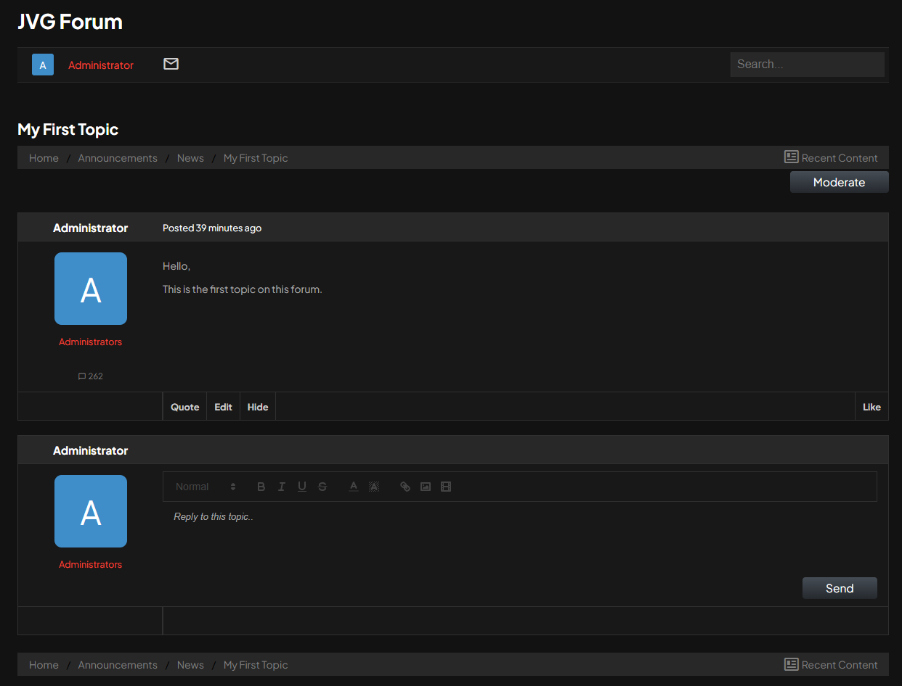
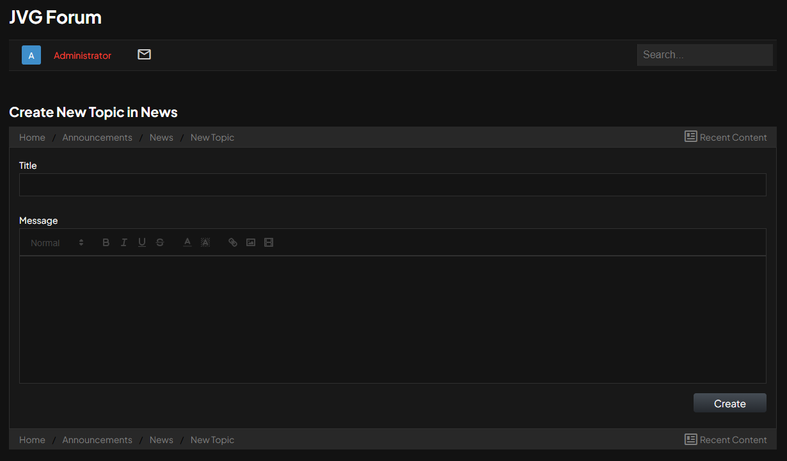

# JVG Forum

This is a PHP forum application, developed as portfolio project to showcase my skills in backend web development. 
It is fully functional and allows users to create topics, posts and have private conversations. 
This project uses no frameworks

### Features
- **User registration and Authentication** Safe registration with bcrypt password hashing
- **Complete CRUD for topics and posts** Users can create and edit their posts
- **Moderation** Moderators will be able to close topics, edit posts, delete posts

### Technologies
- **Backend**: PHP 8.4 (using PDO for database interaction)
- **Database**: MySQL
- **Frontend**: HTML, CSS and as little Javascript as possible
- **Server**: Developed on an Apache web server.

### Dependencies
- **Twig**: The template engine I have chosen to use
- **HtmlSanitizer**: Used to prevent XSS by white listing

### Installation
**1. Clone the repository**
```bash 
git clone https://github.com/jeroenvgestel/jvgforum.git
cd jvgforum
```
**2. Configuration**
- Import the database.sql file into your database
- Copy or rename config/config_dist.php to config/config.php
- Fill in the blanks to match your configuration

**3. Install Dependencies** 
```bash
composer install
```

**4. Start the webserver**
- Ensure you have a local (apache) webserver
- Place the project inside your webserver
- Navigate your browser to the forum

### License ###
This project is licensed under the **MIT License**, do with it what you want


### Contact ###
- **Jeroen van Gestel**
- **GitHub**: [jeroenvgestel](https://github.com/jeroenvgestel)
- **LinkedIn**: https://www.linkedin.com/in/jeroen-van-gestel-363569385/


### Project Screenshots

_A screenshot of the forum index_


_A screenshot of the posts in a topic, with the quick-reply_


_A screenshot of the page to create a new topic_

